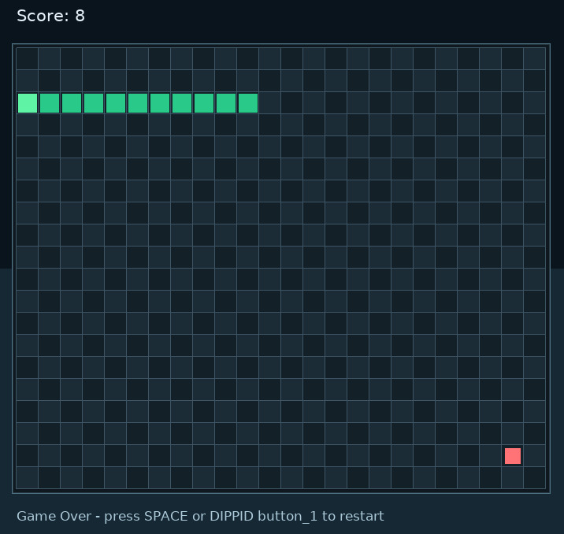

[](https://classroom.github.com/a/Etw90P0Z)
# DIPPID and Pyglet

This repository contains the solutions for Assignment 01:

- Part 1: DIPPID sender simulation
- Part 2: 2D Snake game using pyglet and DIPPID input

## Requirements

- Python 3.10+
- Linux/macOS terminal (commands below use bash)

### Setup (virtual environment)

```bash
python3 -m venv .venv
source .venv/bin/activate
pip install -r requirements.txt
```

## Part 1: DIPPID Sender

Simulate DIPPID capabilities and send UDP JSON packets to localhost.

### Run

```bash
python3 dippid_sender/DIPPID_sender.py
```

### Implemented capabilities

- accelerometer
- button_1

This sender is intended for general DIPPID simulation.


## Part 2: Snake Game

Snake in pyglet with DIPPID-based interaction.


### Run

```bash
python3 2d_game/pyglet_minimal.py
```

### Input and controls

- DIPPID gravity tilt steers the snake. 
- `button_1` toggles pause/resume and restarts after game over.
- Keyboard fallback: arrow keys move, `SPACE` toggles pause, `R` restarts.


### Implemented Features

- Snake movement on a grid with fixed-tick updates
- Food spawning and score tracking
- Snake growth after eating food
- Collision detection (wall and self)
- Pause and restart behavior
- DIPPID input integration via UDP


## AI Usage Declaration

AI tools were used for support during development (implementation, debugging suggestions, refactoring ideas, and style improvements). All generated suggestions were reviewed, adapted, and tested before submission.

### AI Tools Used

OpenAI. (2026). ChatGPT (GPT-5.3-Codex April 25) [Large language model]. https://chat.openai.com/

GitHub. (2026). GitHub Copilot Chat [AI software]. https://github.com/features/copilot